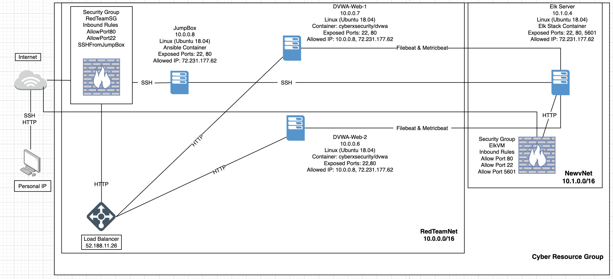
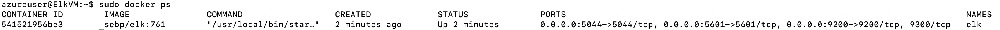

## Automated ELK Stack Deployment

The files in this repository were used to configure the network depicted below.

 

## Docker output here
 

These files have been tested and used to generate a live ELK deployment on Azure. They can be used to either recreate the entire deployment pictured above. Alternatively, select portions of the .yml file may be used to install only certain pieces of it, such as Filebeat.

  - The ansible playbooks install-elk.yml, filebeat-playbook.yml and the metricbeat-playbook.yml are needed to create and implement the Elk Server. 

This document contains the following details:
- Description of the Topologu
- Access Policies
- ELK Configuration
  - Beats in Use
  - Machines Being Monitored
- How to Use the Ansible Build

### Description of the Topology

The main purpose of this network is to expose a load-balanced and monitored instance of DVWA, the D*mn Vulnerable Web Application.

Load balancing ensures that the application will be highly available, in addition to restricting access to the network.

-  What aspect of security do load balancers protect? Load Balancers protect the availability of the network in relation to the CIA triad. 
What is the advantage of a jump box? The jump box sits in front of the other machines that are not exposed to the public internet. It is used to access the network and the virtual machines created. The jump box is configured to download the Docker container that runs Ansible. 

Integrating an ELK server allows users to easily monitor the vulnerable VMs for changes to the _____ and system _____.
- Filebeat collects data about the file system and monitors files for suspicious changes.
- Metricbeat collects matchine metrics such as CPU usage and uptime. 

The configuration details of each machine may be found below.

| Name       	| Function     	| IP Address 	| Operating System     	|
|------------	|--------------	|------------	|----------------------	|
| Jump Box   	| Gateway      	| 10.0.0.8   	| Linux (Ubuntu 18.04) 	|
| DVWA Web-1 	| Docker- DVWA 	| 10.0.0.7   	| Linux (Ubuntu 18.04) 	|
| DVWA Web-2 	| Docker- DVWA 	| 10.0.0.6   	| Linux (Ubuntu 18.04) 	|
| Elk Server 	| Elk Stack    	| 10.1.0.4   	| Linux (Ubuntu 18.04) 	|

### Access Policies

The machines on the internal network are not exposed to the public Internet. 

Only the Jump Box machine can accept connections from the Internet. Access to this machine is only allowed from the following IP addresses: My Public IP Address. 

Machines within the network can only be accessed by SSH.
- The Jump Box can only access the Elk VM by Private IP 10.1.0.4. 

A summary of the access policies in place can be found in the table below.

| Name       	| Publicly Accessible 	| Allowed IP Addresses  	|
|------------	|---------------------	|-----------------------	|
| Jump Box   	| No                  	| Personal IP           	|
| DVWA Web-1 	| No                  	| 10.0.0.8, Personal IP 	|
| DVWA Web-2 	| No                  	| 10.0.0.8, Personal IP 	|
| Elk Server 	| No                  	| 10.0.0.8, Personal IP 	|

### Elk Configuration

Ansible was used to automate configuration of the ELK machine. No configuration was performed manually, which is advantageous because...
The main advantage of automating configuration with Ansible is how simple it is to use and set up. It accelerates the process of setting up configurations for the servers using playbooks. 

The playbook implements the following tasks:
- _TODO: In 3-5 bullets, explain the steps of the ELK installation play. E.g., install Docker; download image; etc._
-  From the ansible container add the new Elk VM to Ansible's hosts file. Add in the Elk group in the hosts file along with it's private IP and specify python3. ([elk] 10.1.0.4 ansible_python_interpreter=/usr/bin/python3)
- Create the playbook install-elk.yml that specifies elk as the target hosts. Within the playbook, set the vm.max_map_count to 262144 to use more memory. Install docker.io and python3-pip apt packages. Installs the pip packages docker, and downloads the Docker container sebp/elk:761. Configures the container to start with the port mappings: 5601:5601, 9200:9200, 5044:5044. Starts the container and enables the docker service on boot. 
- Launch and expose the container. Run the playbook. After it completes, ssh into the Elk server and ensure that sebp/elk:761 container is running. 

The following screenshot displays the result of running `docker ps` after successfully configuring the ELK instance.

Users/alexandravesper/Downloads/README/Images/docker_ps_output.png

### Target Machines & Beats
This ELK server is configured to monitor the following machines:
- 10.0.0.7, 10.0.0.6

We have installed the following Beats on these machines:
- Filebeat and Metricbeat

These Beats allow us to collect the following information from each machine:
-  Filebeat helps generate and organize log files to send to Logstash and Elasticsearch. It logs information about the file system, icluding which files have changed and when.

- Metricbeat will periodically collect metrics from the operating system and from services running on the server. It will show metrics on the system level CPU usage, memory, file system,disk IO and network IO statistics. 

### Using the Playbook
In order to use the playbook, you will need to have an Ansible control node already configured. Assuming you have such a control node provisioned: 

SSH into the control node and follow the steps below:
- Copy the filebeat.yml file and metricbeat.yml file to the /etc/ansible/roles/files/ directory.
- Update the configuration files to include the private IP of the Elk server for the ElasticSearch and Kibana sections.  
- Run the playbook, and navigate to the Filebeat/Metricbeat installation page on the Elk Server GUI to check that the installation worked as expected.

- _Which file is the playbook? Where do you copy it? The playbook is called filebeat-playbook.yml. It is copied to the /etc/ansible/hosts directory.

- _Which file do you update to make Ansible run the playbook on a specific machine? How do I specify which machine to install the ELK server on versus which to install Filebeat on?_The file that needs to be updated is the filebeat-config.yml file which is the configuration file. It needs to be updated with the private IP address of the Elk server in lines #1106 and #1806. In the ansible container's hosts file the elk group should be added  with the private IP of the Elk server. 

- _Which URL do you navigate to in order to check that the ELK server is running?
The URL to verify the Elk server is running is http://[public ip address]:5601/app/kibana

_As a **Bonus**, provide the specific commands the user will need to run to download the playbook, update the files, etc._
Commands to run the Ansible configuration on the Elk Server: 
- ssh azureuser@(jumpboxprivateip)
- sudo docker start (container_name)
- sudo docker attach (container_name)
- cd /etc/ansible/
- ansible-playbook install-elk.yml 
- cd /etc/ansible/roles/
- ansible-playbook filebeat-playbook.yml
- Go to http://[public ip address]:5601/app/kibana to check data
